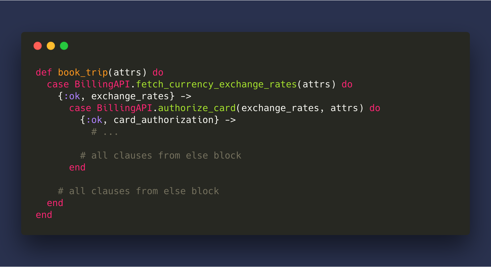

autoscale: true
build-lists: true

^ Today we will talk about ..

# Sagas of Elixir

---

## About me
[.build-lists: false]

- Elixir dev for _2+ years_
- Worked on _NHS of Ukraine_ and few other large projects
- Maintain _20+ public_ Elixir repos used in production
- Contribute back as much as I can


^ And before we begin I want to tell few words about me

^ I am Elixir dev for more than 2 years

^ I maintain more than 20 open source repos and you may use some of them,
if you do - please talk to me and give a feedback

---

## We are going to talk about

* Why do we need _distributed transactions_?
* _Sagas_ pattern
* _Sage_ Elixir library
* Structuring your _domain contexts_ <sub>(bonus)</sub>

^ So what are going to talk about? ...

^ And as a bonus point how can we use Sagas to better structure your domain contexts

---

## Imagine we are building a _simple_ booking website


Invariants:
- We should not charge card if request was not fulfilled
- We should not hold booking if charge is failed

^ So to make a booking we need to fetch currency exchange rates,
pre-authorize the card to make sure customer has enough money,
make the actual booking,
send the receipt and then
charge the card to take money from the account

---


<!-- ```elixir
def book_trip(attrs) do
  with {:ok, exchange_rates} <- BillingAPI.fetch_currency_exchange_rates(attrs),
       {:ok, card_authorization} <- BillingAPI.authorize_card(exchange_rates, attrs),
       {:ok, hotel_booking} <- HotelBookingAPI.book_hotel(attrs),
       :ok <- Mailer.send_email_confirmation(card_authorization, hotel_booking, attrs),
       {:ok, charge} <- BillingAPI.charge_card(card_authorization) do
    {:ok, %{charge: charge, bookings: [hotel_booking]}}
  end
end
``` -->

^ Here is the way how we can write a happy-path implementation for it in Elixir

---

### _with_ compiles to nested cases



<!-- ```elixir
def book_trip(attrs) do
  case BillingAPI.fetch_currency_exchange_rates(attrs) do
    {:ok, exchange_rates} ->
      case BillingAPI.authorize_card(exchange_rates, attrs) do
        {:ok, card_authorization} ->
          # ...

        # all clauses from else block
      end

    # all clauses from else block
  end
end
``` -->

^ For Erlang folks that are not familiar with `with` expression type, it just compiles to nested cases.

^ And if we had an else block within the `with` expression you would see it's clauses in all of those cases.

---

^ The code was really simple and we definitely need to add some error handling to it, let's see what errors we might have

## Handling failures


^ If we failed on one of first two steps - it's okay, there are no side-effects and we can just return an error

^ If we failed to book a hotel that's still okay, we don't need to cancel authorization because money would be returned automatically when authorization timeout expires.

^ We may need to make sure that we did not actually book it and not received a response from the third-party API, but let's skip if for now.

^ We don't care about email confirmation that much, we can retry the delivery and customer would still get a receipt in the UI

^ But when the charge failed we already hold a booking and we need to cancel it

---


<!-- ```elixir
def book_trip(attrs) do
  with {:ok, exchange_rates} <- BillingAPI.fetch_currency_exchange_rates(attrs),
       {:ok, card_authorization} <- BillingAPI.authorize_card(exchange_rates, attrs),
       {:ok, hotel_booking} <- HotelsBookingAPI.book_hotel(attrs),
       :ok <- Mailer.send_email_confirmation(card_authorization, hotel_booking, attrs),
       {:charge, {:ok, charge}, _} <- {:charge, BillingAPI.charge_card(card_authorization), [hotel_booking]} do
    {:ok, %{charge: charge, bookings: [hotel_booking]}}
  else
    {:charge, {:error, reason], [hotel_booking]} ->
      :ok = send_excuse_email(authorization)
      :ok = cancel_booking(hotel_booking)
      {:error, reason}

    other ->
      other
  end
end
``` -->

^ To handle that failure we extending the previous example with error handling

^ Here I use simple trick and wrap charge call with a tuple, which has stage name
and list of side effects which we must take care of if we failed on that stage

^ When charge stage fails we send the excuse email because we already sent a receipt
and cancel the booking

^ The code still looks fairly simple, but the real world is not like that so let's make it a little bit harder

---

## Let's make it harder


^ Now we want not only book a hotel, but also book a flight and a car, and ..

---

## Oops, failed to book a flight


^ And if we failed on one of the bookings, we need to cancel other ones
and if we failed to charge the card we need to cancel all of them

---


<!-- ```elixir
def book_trip(attrs) do
  with {:ok, exchange_rates} <- BillingAPI.fetch_currency_exchange_rates(attrs),
       {:ok, card_authorization} <- BillingAPI.authorize_card(exchange_rates, attrs),
       {:booking, {:ok, hotel_booking}, _} <- {:booking, HotelsBookingAPI.book_hotel(attrs), []},
       {:booking, {:ok, car_booking}, _} <- {:booking, CarsBookingAPI.book_hotel(attrs), [hotel_booking]},
       {:booking, {:ok, flight_booking}, _} <- {:booking, FlightsBookingAPI.book_hotel(attrs), [hotel_booking, car_booking]},
       :ok <- Mailer.send_email_confirmation(card_authorization, hotel_booking, attrs),
       {:charge, {:ok, charge}, _} <- {:charge, BillingAPI.charge_card(card_authorization), [...]} do
    {:ok, %{charge: charge, bookings: [hotel_booking, car_booking, flight_booking]}}
  else
    {:charge, {:error, reason], bookings} ->
      :ok = send_excuse_email(authorization)
      :ok = cancel_bookings(bookings)
      {:error, reason}

    {:booking, {:error, reason}, bookings} ->
      :ok = cancel_bookings(bookings)
      {:error, reason}
  end
end
``` -->

^ Now the code to handle failures gets worse:
we need to use more named stages, we need to think though collecting the side effects and else clause keeps growing

---

## What is wrong?

- Bad for latency - can't book concurrently
- The syntax to track step on which failure occurred is ugly
- To test it you need a complex failure injection for API client stubs
- Easy to miss some errors - monster else clause

^ And thats not all, we can't book concurrently, syntax looks ugly, it's hard to test

^ And the worst part of it is that when there are more edge cases we need to care of - else block keeps growing.

^ For example, It doesn't cover error handling when the request is delivered but we did not get the response,
to handle that we would use three different stage names for bookings and duplicate the error handling code

---


<!-- ```elixir
def book_trip(attrs) do
  with {:ok, exchange_rates} <- BillingAPI.fetch_currency_exchange_rates(attrs),
       {:ok, card_authorization} <- BillingAPI.authorize_card(exchange_rates, attrs),
       {:hotel_booking, {:ok, hotel_booking}, _} <- {:hotel_booking, HotelsBookingAPI.book_hotel(attrs), []},
       {:car_booking, {:ok, car_booking}, _} <- {:car_booking, CarsBookingAPI.book_hotel(attrs), [hotel_booking]},
       {:flight_booking, {:ok, flight_booking}, _} <- {:flight_booking, FlightsBookingAPI.book_hotel(attrs), [hotel_booking, car_booking]},
       :ok <- Mailer.send_email_confirmation(card_authorization, hotel_booking, attrs),
       {:charge, {:ok, charge}, _} <- {:charge, BillingAPI.charge_card(card_authorization), [...]} do
    {:ok, %{charge: charge, bookings: [hotel_booking, car_booking, flight_booking]}}
  else
    {:charge, {:error, reason], bookings} ->
      :ok = send_excuse_email(authorization)
      :ok = cancel_bookings(bookings)
      {:error, reason}

    {:hotel_booking, {:error, reason}, bookings} ->
      :ok = cancel_bookings(bookings)
      :ok = HotelsBookingAPI.maybe_ensure_deleted(reason, attrs)
      {:error, reason}

    # ...
    # TODO: 😅 😱 🤬
  end
end
``` -->

^ To handle them we would split booking stage in thee different ones just to add that single call to ensue booking is not successful

---

# Can we do better?

- Refactor
- 2PC
- Sagas

^ Is there a way to make it look better?

^ We can refactor it and split it into multiple pieces but we would still get an error handling duplication
so it's easy to update it in one of the places forgetting about the others

^ 2PC doesn't scale - it spawns too many messages, hurts availability because of locks involved and
you won't get them with most of providers. At least I am not aware of any services that support them.

^ And there is Sagas

---

# Sagas Pattern

Failure management pattern that originates from _1987’s_ paper on long running transactions for databases.

A long lived transaction is a Saga if it can be written as a sequence of transactions that can be interleaved with other transactions.

The database management system guarantees that either all the transactions in a Saga are successfully completed or compensating transactions are run to amend a partial execution.

^ Saga is a failure management pattern that originates from _1987’s_ paper.
It's original use case is about long lived transactions, a good example of it
is an annual financial report which can take a while and you don't want to
stop processing new entries while it's running.

^ So It's goal is to get rid of the locks but still guarantee that state is consistent
after execution is finished.

^ With Saga you tradeoff atomicity for availability.

---

## How does it work?

- Transaction is split into a multiple _atomic steps_
- Each step consist from _transaction_ and _compensation_
- When transaction fails compensation are run to
_semantically_ amend it's effects
- Compensation and transactions should be _idempotent_

^ The way how does it work is...

^ ... idempotent, which means that we should be able to safely retry them without creating new side effects.

^ What is the most important for me is that it gives us a new mental model how do we think about failure management.

---

## Booking site with Sagas


^ Getting back to our booking site, with Saga you define a compensation for each step and Saga makes sure that
if one of the stage failed (which is flight booking in our example), compensations are run to amend partial execution

---

# Awesome!

## Anything for Elixir?

^ That Saga idea sounds pretty awesome, is there are something that we can use?

---

# Sage

Sage is a dependency-free pure Elixir library inspired by Sagas pattern.

Provides set of additional features on top of steps, transactions and compensations defined by the original paper.

^ Sage is dependency-free pure Elixir library inspired by Sagas pattern and provides set of nice features on top of it.

---

> It's like *Ecto.Multi* but across business logic and third-party APIs.
-- @jayjun from #elixir-lang Slack channel

^ For people familiar with Elixir, there is a nice quote that described what is it to work with Sage:

^ It's like *Ecto.Multi* but across business logic and third-party APIs.

---

## Booking example with Sage


<!-- ```elixir
import Sage

@spec create_and_subscribe_user(attrs :: map()) ::
        {:ok, last_effect :: any(), all_effects :: map()} | {:error, reason :: any()}
def book_trip(attrs) do
  new()
  |> run(:exchange_rate, &Billing.fetch_currency_exchange_rates/2, &Billing.currency_exchange_rates_circuit_breaker/4)
  |> run(:authorization, &Billing.authorize_card/2, &Billing.cancel_card_authorization/4)
  |> run_async(:book_hotel, &HotelsBooking.book/2, &HotelsBooking.cancel_booking/4)
  |> run_async(:book_car, &CarsBooking.book/2, &CarsBooking.cancel_booking/4)
  |> run_async(:book_flight, &FlightsBooking.book/2, &FlightsBooking.cancel_booking/4)
  |> run(:email_confirmation, &Mailer.send_email_confirmation/2)
  |> run(:charge, &Billing.charge_authorization/2, &Billing.refund_payment/4)
  |> transaction(Repo, attrs)
end
``` -->

^ Internally, Sage is a data structure that you build by appending atomic stages to it,
after its built you can execute it.., optionally within a database transaction.

^ When Sage is executed it would do it's best to either finish the transactions or
to run compensations for all created effects.

^ This code sample shows really a lot of features and let's go through them

---

### Asynchronous transactions


^ So the first one is that allows you to run transactions asynchronously, they are started as Tasks under the separate supervisor and not linked to the current process.
Before next synchronous operation Sage will await for all spawned tasks.

^ This is because we want to make sure it has access to effects created, where stages
that asynchronously don't have access to each others effects.

---

### Retries


^ The second one is that it makes it easy implement retries, they work like a checkpoints and you can decide from which stage we should apply forward recovery


---


<!-- ```elixir
def delete_subscription(_effect_to_compensate, %{user: user}, _name_and_reason, _attrs) do
  :ok = SageExample.Billing.APIClient.delete_all_subscriptions_for_user(user)
  # We want to apply forward recovery from :subscription stage for 5 times
  {:retry, retry_limit: 5, base_backoff: 10, max_backoff: 30_000, enable_jitter: true}
end
``` -->

^ To define a savepoint you write a compensation that still does its job, but after that you tell the Sage to keep retrying from current state and you can limit maximum number of retries with exponential backoff and a jitter

^ The retry count is global for all sage execution, by doing that we make sure that we would not keep retrying indefinitely

---

### Circuit breakers


^ And the third one is circuit breakers. They are useful when we can continue the execution with some known value.

^ In out example we want to know actual currency exchange rates on each execution but if the service is not available - we can continue by using cached value.

---


<!-- ```elixir
def currency_exchange_rates_circuit_breaker(_effect_to_compensate, _effects_so_far, _name_and_reason, attrs) do
  base_currency = Map.fetch!(attrs, "base_currency")
  with {:ok, exchange_rates} <- BookingApp.Cache.fetch(:eur_exchange_rates, base_currency) do
    {:continue, exchange_rates}
  else
    _ -> :ok
  end
end
``` -->

^ In terms in implementation, they look pretty much the same as retries, but you can only apply a circuit breaker if the failure is occurred within the same stage, because we don't to accidentally start forward recovery from a failed stage.

---

### And more

- Final callback
- Tracing
- Works with Ecto

^ And there is more:

^ A callback which is executed when sages execution either succeeds or fails

^ A module callback to get instrumentation events during sage execution, so you can log them or measure stage execution time

^ And it allows you to execute a Sage within database transactions so if you have code that works with local database you can still rely on its isolation properties

---

## Error handling

^ A few words about how Sage handles errors

- Sage transaction abort

^ Transaction abort is a very basic case when transaction can not be completed, we start backward recovery and amend all created effects.

- Compensation failure

^ Whenever compensation can not amend the transaction Sage will raise an error and expect developer to manually investigate the issue. However, it’s possible to write an adapter that would handle those cases, eg. by retrying compensations after third-party service is recovered.

- Bugs in Sage

^ Bugs in Sage are currently not handled, but there are more things to come

---

## Things to come

- Saga execution log
- Plug-style module callbacks
- Compile-time type checking

^ Saga execution log which writes Sage state into a pesistent storage, so we would be able to recover after process or node failures,
or even continue the execution after we fixed the bug.

^ Plug-style module callbacks to make code look even better.

^ And Dialyzer integration for compile-type type checking which would warn you if your Sage struct going to fail at runtime.

---

## And it makes your domain contexts better

---


<!-- ```elixir
def book_trip(attrs) do
  Sage.new()
  |> Billing.authorize_card()
  |> Hotels.book_hotel()
  |> Cars.book_car()
  |> Flights.book_flight()
  |> Users.sign_up()
  |> Billing.charge_card()
  |> Sage.transaction(Repo, attrs)
end
``` -->

^ Similarly to Ecto.Multi, Sage allows you to compose a transaction where stages can
live in completely different domain contexts

---

# Recap
[.build-lists: false]

^ As a short recap use sage to:

Use Sage to:

- Synchronize state across microservices

^ Synchronize state across microservices maybe not the best case because you have control over them and there are much more options to consider, like not using microservice architecture at all :).

- Synchronize state across databases

^ Synchronize state across databases which is somewhat similar to microservices.

- To run distributed transactions

^ To run distributed transactions and I think this one where Sagas fit the best, because here we interacting with a system which is out of our control, has limited set of features exposed over API and unlikely to change on our demand.

Sage can help to elegantly organize logic in your domain contexts.

Still young but well-documented and covered with tests.

---

# Thank you! Questions?

github.com/nebo15/sage

GitHub:            AndrewDryga
Twitter:           andrew_dryga
Elixir-Lang Slack: AndrewDryga
Email:             andrew@dryga.com
