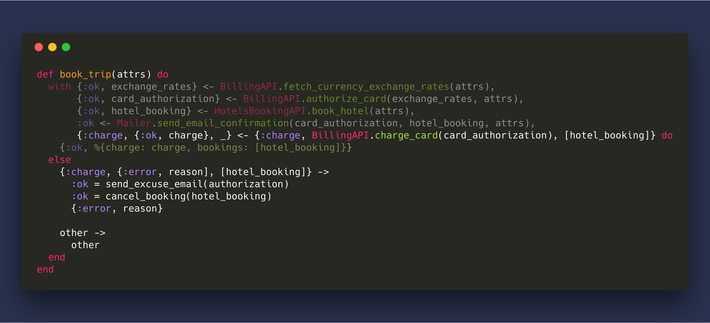
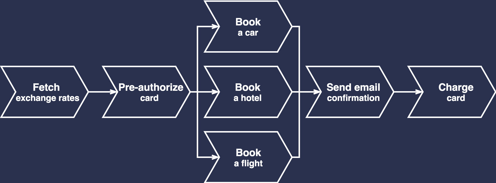

autoscale: true
build-lists: false

# Sagas of Elixir

^ Hi guys!

---

## About me
[.build-lists: false]

- 14 years in IT, Elixir dev for _2+ years_
- Worked on _NHS of Ukraine_ and few other large projects
- Maintain _20+ public_ Elixir repos used in production
- Contribute back as much as I can


^ Before we begin I want to tell few words about me

^ I am Elixir dev for more than 2 years

^ I maintain about 20 packages and you may use some of them, if you do - please talk to me and give a feedback

^ And we have like 100 open source repos in our GitHub organization, nobody even knows that you can find there.

---

## We are going to talk about

* Why do we need _distributed transactions_?
* _Sagas_ pattern
* _Sage_ Elixir library
* Structuring your _domain contexts_ <sub>(bonus)</sub>

^ Today we are going to talk about:

^  Why do we need _distributed transactions_?

^  _Sagas_ pattern

^  _Sage_ library that implements them

^ And as a bonus point how can we use Sagas to better structure your domain contexts

---

## Imagine we are building a _simple_ booking website


Invariants:
- We should not charge card if request was not fulfilled
- We should not hold booking if charge is failed

^ Imagine we are building a simple booking website

^ To book a trip we need to fetch currency exchange rates,
pre-authorize the card to make sure customer has enough money,
make the actual booking,
send the receipt and then
charge the card to take money from the account

^ And we want to hold two invariants here:
- We should not charge card if request was not fulfilled
- We should not hold booking if charge is failed, otherwise we would continue to pay for them and it would be a bad business for us

---


<!-- ```elixir
def book_trip(attrs) do
  with {:ok, exchange_rates} <- BillingAPI.fetch_currency_exchange_rates(attrs),
       {:ok, card_authorization} <- BillingAPI.authorize_card(exchange_rates, attrs),
       {:ok, hotel_booking} <- HotelBookingAPI.book_hotel(attrs),
       :ok <- Mailer.send_email_confirmation(card_authorization, hotel_booking, attrs),
       {:ok, charge} <- BillingAPI.charge_card(card_authorization) do
    {:ok, %{charge: charge, bookings: [hotel_booking]}}
  end
end
``` -->

^ Here is the way how we can implement this flow in Elixir.

^ GIVE 30 SECONDS TO READ IT! DRINK A WATER

---

### _with_ compiles to nested cases


<!-- ```elixir
with {:ok, bar} <- foo(),
     {:ok, buz) <- fiz(bar) do
  {:ok, [bar, buz]}
else
  :error -> {:errors, :are_bad_mmkay?}
  nil -> {:error, :not_found)
end
``` -->

<!-- ```elixir
case foo() do
  {:ok, bar} ->
    case fiz(bar) do
      {:ok, buz} ->
        {:ok, [bar, buz]}

      :error ->
        {:errors, :are_bad_mmkay?}

      nil ->
        {:error, :not_found)
    end  

  :error ->
    {:errors, :are_bad_mmkay?}  

  nil ->
    {:error, :not_found)
end
``` -->

^ For Erlang folks that are not familiar with `with` expression - it just compiles to nested cases.

^ And if we have an else block in it, all clauses from the block would be copied to all of the cases.

---

## Handling failures


^ The code was really simple and we definitely need to add some error handling to it, let's see what errors we might have:

^ If we failed on one of first two steps - it's okay, there are no side-effects and we can just return an error

^ If we failed to book a hotel that's still okay, we don't need to cancel authorization because money would be returned automatically when authorization timeout expires.

^ We don't care about email confirmation that much, we can retry the delivery and customer would still get a receipt in the UI

^ But when the charge failed we already hold a booking and we need to cancel it

---



<!-- ```elixir
def book_trip(attrs) do
  with {:ok, exchange_rates} <- BillingAPI.fetch_currency_exchange_rates(attrs),
       {:ok, card_authorization} <- BillingAPI.authorize_card(exchange_rates, attrs),
       {:ok, hotel_booking} <- HotelsBookingAPI.book_hotel(attrs),
       :ok <- Mailer.send_email_confirmation(card_authorization, hotel_booking, attrs),
       {:charge, {:ok, charge}, _} <- {:charge, BillingAPI.charge_card(card_authorization), [hotel_booking]} do
    {:ok, %{charge: charge, bookings: [hotel_booking]}}
  else
    {:charge, {:error, reason], [hotel_booking]} ->
      :ok = send_excuse_email(authorization)
      :ok = cancel_booking(hotel_booking)
      {:error, reason}

    other ->
      other
  end
end
``` -->

^ To do that, we can use simple trick and wrap charge call with a tuple, which has stage name and list of side effects which we must take care of if we failed on that stage

^ When charge stage fails we send the excuse email because we already sent a receipt.
And then cancel the booking

^ The code still looks fairly simple, but the real world is not like that so let's make it a little bit harder

---

## Let's make it harder



^ Now we want not only book a hotel, but also book a flight and a car, and ..

---

## Oops, failed to book a flight


^ And if some of the bookings failed, we need to cancel other ones
and if we failed to charge the card we need to cancel all of them

---


<!-- ```elixir
def book_trip(attrs) do
  with {:ok, exchange_rates} <- BillingAPI.fetch_currency_exchange_rates(attrs),
       {:ok, card_authorization} <- BillingAPI.authorize_card(exchange_rates, attrs),
       {:booking, {:ok, hotel_booking}, _} <- {:booking, HotelsBookingAPI.book_hotel(attrs), []},
       {:booking, {:ok, car_booking}, _} <- {:booking, CarsBookingAPI.book_hotel(attrs), [hotel_booking]},
       {:booking, {:ok, flight_booking}, _} <- {:booking, FlightsBookingAPI.book_hotel(attrs), [hotel_booking, car_booking]},
       :ok <- Mailer.send_email_confirmation(card_authorization, hotel_booking, attrs),
       {:charge, {:ok, charge}, _} <- {:charge, BillingAPI.charge_card(card_authorization), [...]} do
    {:ok, %{charge: charge, bookings: [hotel_booking, car_booking, flight_booking]}}
  else
    {:charge, {:error, reason], bookings} ->
      :ok = send_excuse_email(authorization)
      :ok = cancel_bookings(bookings)
      {:error, reason}

    {:booking, {:error, reason}, bookings} ->
      :ok = cancel_bookings(bookings)
      {:error, reason}
  end
end
``` -->

^ Now the code to handle failures gets worse: we need to use more named stages and we need to think though collecting the side effects

---

## What is wrong?

- Bad for latency - can't book concurrently
- The syntax to track step on which failure occurred is ugly
- To test it you need a complex failure injection for API client stubs
- Easy to miss some errors - monster else clause

^ And thats not all, we can't book concurrently, syntax looks ugly, it's hard to test

^ And the worst part of it is that when there are more edge cases - else block keeps growing.

^ For example, It doesn't cover the scenario when the booking request is delivered but we did not get the response, so we are paying for booking and don't know anything about it

---


<!-- ```elixir
def book_trip(attrs) do
  with {:ok, exchange_rates} <- BillingAPI.fetch_currency_exchange_rates(attrs),
       {:ok, card_authorization} <- BillingAPI.authorize_card(exchange_rates, attrs),
       {:hotel_booking, {:ok, hotel_booking}, _} <- {:hotel_booking, HotelsBookingAPI.book_hotel(attrs), []},
       {:car_booking, {:ok, car_booking}, _} <- {:car_booking, CarsBookingAPI.book_hotel(attrs), [hotel_booking]},
       {:flight_booking, {:ok, flight_booking}, _} <- {:flight_booking, FlightsBookingAPI.book_hotel(attrs), [hotel_booking, car_booking]},
       :ok <- Mailer.send_email_confirmation(card_authorization, hotel_booking, attrs),
       {:charge, {:ok, charge}, _} <- {:charge, BillingAPI.charge_card(card_authorization), [...]} do
    {:ok, %{charge: charge, bookings: [hotel_booking, car_booking, flight_booking]}}
  else
    {:charge, {:error, reason], bookings} ->
      :ok = send_excuse_email(authorization)
      :ok = cancel_bookings(bookings)
      {:error, reason}

    {:hotel_booking, {:error, reason}, bookings} ->
      :ok = cancel_bookings(bookings)
      :ok = HotelsBookingAPI.maybe_ensure_deleted(reason, attrs)
      {:error, reason}

    # ...
    # TODO: 😅 😱 🤬
  end
end
``` -->

^ To handle that we would use three different stage names for bookings and duplicate the error handling code.. With only one of those stages this example is already too big to be included it slides.

^ Now imagine how much bigger it would be if we want to explicitly release the authorization so that customers doesn't wait for timeout to get their money back..

^ This code already smells like a distributed transaction and I believe it is complex because we are dealing with distributed transaction in ad-hock fashion.

---

# Distributed transactions are everywhere

- CRM and Campaign Automation (Salesforce, Hubspot, Intercom, Autopilot)
- Payment Processors (Stripe, Braintree, PayPal)
- Analytics (GA, Mixpanel)
- Cloud Providers (Google Cloud, AWS)
- Any other SaaS integration
- Microservices

^ And distributed transactions are really everywhere - each time you interact with CRM's, payment processors, any other SaaS tools or even your own microservices - it's very likely that you would deal with them.

^ I'm not talking here about research projects and large enterprises that distribute because of their scale, I'm talking about small and medium projects that have those transactions. That's due to how software development works in 21 century - you write your core and use bunch of paid subscriptions because there is a SaaS for everything and nobody likes to reinvent the wheel.

---

# Can we do better?

- Refactor
- 2PC
- Sagas

^ So is there a way to make implementation look better?

^ We can refactor it and split it into multiple pieces but we would still get an error handling duplication
so it's easy to update it in one of the places forgetting about the others

^ 2PC doesn't scale - it spawns too many messages, hurts availability because of locks involved and
you simply won't get them, at least I don't know any services that support them.

^ And there are SAGAAAS

---

# Sagas Pattern

Failure management pattern that originates from _1987’s_ paper on long running transactions for databases.

A long lived transaction is a Saga if it can be written as a sequence of transactions that can be interleaved with other transactions.

The database management system guarantees that either all the transactions in a Saga are successfully completed or compensating transactions are run to amend a partial execution.

^ Saga is a failure management pattern that originates from NINEteen EIGHTy seven paper.
It's original use case is about long lived transactions, a good example of it
is an annual financial report. It can take a while and you don't want to
stop processing new entries while it's running.

^ So It's goal is to get rid of the locks but still guarantee that state is consistent
after execution is finished.

^ With Saga you tradeoff atomicity for availability.

---

## How does it work?

- Transaction is split into a multiple _atomic steps_
- Each step consist from _transaction_ and _compensation_
- When transaction fails compensation are run to
_semantically_ amend it's effects
- Compensation and transactions should be _idempotent_

^ The way how does it work is really simple...

^ ...

^ By saying semantically I mean that there are some operations that can not be rolled back, for example when we sent an email we can't just delete it from customer inbox, but we can send second email and excuse for an error.

^ Compensation and transactions should be idempotent, which means that we should be able to safely retry them without creating new side effects.

^ What is the most important for me is that it gives us a new mental model how do we think about failure management.

---

## Booking site with Sagas


^ Getting back to our booking site, with Saga you define a compensation for each step and Saga makes sure that if one of the stage failed (which is flight booking in our example), compensations are run to amend partial execution

^ So it's like we have a step-by-step map how to get to the destination and plan B how to return back from any step by a secure route.

---

# Awesome!

## Anything for Elixir?

^ That Saga idea sounds pretty awesome, is there are something that we can use?

^ And the answer is yes

---

# Sage

Sage is a dependency-free pure Elixir library inspired by Sagas pattern.

Provides set of additional features on top of steps, transactions and compensations defined by the original paper.

^ There is Gisla implemented in Erlang by Mark Allen and there is Sage..

^ Sage is dependency-free pure Elixir library inspired by this pattern and provides set of features on top of Sagas.

---

> It's like *Ecto.Multi* but across business logic and third-party APIs.
-- @jayjun from #elixir-lang Slack channel

^ For people familiar with Ecto, there is a nice quote that describes what is it to work with Sage:

^ It's like *Ecto.Multi* but across business logic and third-party APIs.

---

## Booking example with Sage


<!-- ```elixir
import Sage

@spec create_and_subscribe_user(attrs :: map()) ::
        {:ok, last_effect :: any(), all_effects :: map()} | {:error, reason :: any()}
def book_trip(attrs) do
  new()
  |> run(:exchange_rate, &Billing.fetch_currency_exchange_rates/2, &Billing.currency_exchange_rates_circuit_breaker/4)
  |> run(:authorization, &Billing.authorize_card/2, &Billing.cancel_card_authorization/4)
  |> run_async(:book_hotel, &HotelsBooking.book/2, &HotelsBooking.cancel_booking/4)
  |> run_async(:book_car, &CarsBooking.book/2, &CarsBooking.cancel_booking/4)
  |> run_async(:book_flight, &FlightsBooking.book/2, &FlightsBooking.cancel_booking/4)
  |> run(:email_confirmation, &Mailer.send_email_confirmation/2)
  |> run(:charge, &Billing.charge_authorization/2, &Billing.refund_payment/4)
  |> transaction(Repo, attrs)
end
``` -->

^ Internally, Sage is a data structure that you build by appending atomic stages to it. So you only execute the Sage when the struct is built.

^ And when it's executed Sage would do it's best to either finish the transactions or to run compensations for all created effects.

^ This code sample shows really a lot of Sage features so let's go through them

---

### Asynchronous transactions


^ The first one is that Sage allows you to run transactions asynchronously, they are started as Tasks and not linked to the process that executes the Saga.

^ Before next synchronous operation Sage will await for all spawned tasks.

^ This is because we want to make sure that synchronous stage has access to effects created before it, where stages
that run asynchronously don't have access to each others effects.

---

### Retries


^ The second one is that it makes it easy implement retries, they work like a checkpoints and you can decide from which stage we should apply forward recovery

^ In this example we rollback few bookings before retrying them, but nothing stops us to retry only the failed stage.

---


<!-- ```elixir
def delete_subscription(_effect_to_compensate, %{user: user}, _name_and_reason, _attrs) do
  :ok = SageExample.Billing.APIClient.delete_all_subscriptions_for_user(user)
  # We want to apply forward recovery from :subscription stage for 5 times
  {:retry, retry_limit: 5, base_backoff: 10, max_backoff: 30_000, enable_jitter: true}
end
``` -->

^ To define a savepoint you write a compensation that still does its job, but after that you tell the Sage to keep retrying from current state and you can limit maximum number of retries with exponential backoff and a jitter

^ The retry count is global for all execution steps, by doing that we make sure that we would not keep retrying indefinitely

---

### Circuit breakers


^ The third one is circuit breakers. They are useful when we after failure can continue the execution with some predefined value.

^ In our example we want to know actual currency exchange rates on each execution but if the service is not available - we can continue by using cached value.

^ Circuit breakers give you a lot of power to make your service truly reliable and not to depend on third-parties availability that much.

---


<!-- ```elixir
def currency_exchange_rates_circuit_breaker(_effect_to_compensate, _effects_so_far, _name_and_reason, attrs) do
  base_currency = Map.fetch!(attrs, "base_currency")
  with {:ok, exchange_rates} <- BookingApp.Cache.fetch(:eur_exchange_rates, base_currency) do
    {:continue, exchange_rates}
  else
    _ -> :ok
  end
end
``` -->

^ In terms in implementation, they look pretty much the same as retries, but you can only apply a circuit breaker if the failure is occurred within the same stage, because we don't to accidentally start forward recovery when we trying to rollback the transaction.

---

### And more

- Final callback
- Tracing
- Easier to test
- Works with Ecto

^ Also there is:

^ A callback which is executed when Sage either succeeds or fails

^ A module callback that would get instrumentation events, so you can log stages or measure their execution time

^ It's easier to test, which is petty much the same as with controllers. You don't want to write a lot of high level tests to cover them, instead you just cover the basic cases to make sure the composition works and then test separately low-level stuff, in our case transaction and compensation callbacks.

^ And it allows you to execute a Sage within database transactions so if you have code that works with local database you can still rely on its isolation properties

---

## Error handling

^ Let's look how Sage handles errors

- Sage transaction abort

- Compensation failure

- Bugs in Sage

^ When there is an error or unmatched return in transaction we just start backward recovery to amend created effects

^ When there is an error in compensation, Sage will raise an exception and expect developer to manually investigate the issue. However, it’s possible to write an adapter that would handle those cases, eg. by retrying compensations after third-party service is recovered.


^ Bugs in Sage are currently not handled, but there are more things to come

---

## Things to come

- Saga execution log
- Compile-time type checking

^ Saga execution log which writes Sage state into a pesistent storage, so we would be able to recover when the process or node crashes or even continue the execution after we fixed the bug.

^ Plug-style module callbacks to make code look even better.

^ And Dialyzer integration for compile-time type checking which would warn you if your Sage struct going to fail at runtime.

---

## And it makes your domain contexts better

---


<!-- ```elixir
def book_trip(attrs) do
  Sage.new()
  |> Billing.authorize_card()
  |> Hotels.book_hotel()
  |> Cars.book_car()
  |> Flights.book_flight()
  |> Users.sign_up()
  |> Billing.charge_card()
  |> Sage.transaction(Repo, attrs)
end
``` -->

^ Similarly to Ecto.Multi, Sage allows you to compose a transaction where stages can live in completely different domain contexts

^ So high level API creates a structure and then calls the contexts, that are appending to the structure. Result is run within a single transaction and we guarantee that we don't have side effects in case we failed somewhere

^ For large applications it's very beneficial because you can make your code more decoupled, only thing left is that we still need to keep track of internal dependencies, because steps tend use effects created by the predecessors.

---

<!-- ## Send events only _after_ transaction is committed

```elixir
defmodule MyApp.Domain.Users.UseCase do
  def sign_up(attrs) do
    MyApp.Domain.Repo.transaction(fn ->
      # ... create an account ...
      MyApp.broadcast(MyApp.PubSub, "account.created", account: account)
      account
    end)
  end
end
```

```elixir
defmodule MyApp.Domain.Users.UseCase do
  def sign_up(attrs) do
    with {:ok, {account, events}} <- create_account(attrs) do
      for {:event, kind, metadata} <- events do
        MyApp.broadcast(MyApp.PubSub, kind, metadata)
      end

      {:ok, account}
    end
  end

  defp create_account(attrs) do
    MyApp.Domain.Repo.transaction(fn ->
      # ... create an account ...
      {account, [{:event, "account.created", account: account}]}
    end)
  end
end
```

^ A this is a very common case I've dealt with. Usually we spawn a lot of events and it's a very bad practice to spawn them from within the transaction - we don't have a way to cancel them but the transaction can be rolled back.

^ And sometimes sending events before transaction is committed creates a race condition. When there is a code that listens for events and reads the value from database it would crash, because the value can be not there yet.

^ Also, sometimes the high-level code knows better what events it should send and we don't want to fire them from within a context at all.

^ In that scenarios we can threat events as effects, return them, accumulate and only fire when transaction is succeeded. -->

<!-- --- -->

# Recap
[.build-lists: false]

^ As a short recap use sage to:

Use Sage to:

- Synchronize state across microservices

- Synchronize state across databases

- To run distributed transactions

Sage can help to elegantly organize logic in your domain contexts.

Still young but well-documented and covered with tests.

^ Synchronize state across microservices, but maybe that's not the best case because you have control over them, and there are much more options to consider, like not using microservice architecture at all :).

^ Synchronize state across databases which is somewhat similar to microservices.

^ To run distributed transactions where I think it fits the best, because here we interacting with a system which is out of our control, has limited set of features exposed over API and unlikely to change on our demand.

^ It's still pretty young but well-documented and covered with tests.

---

# Thank you! Questions?

github.com/nebo15/sage

GitHub:            AndrewDryga
Twitter:           andrew_dryga
Elixir-Lang Slack: AndrewDryga
Email:             andrew@dryga.com

^ Thank you.

^ You can find me over the internet.

^ Any questions?
